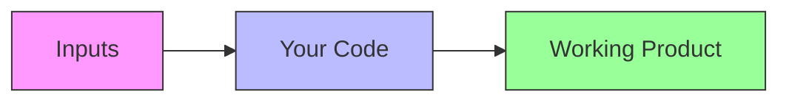

# Daily Digest Dashboard - Python Bootcamp (AI-Assisted)

## 📋 Project Overview
A 4-week project-based course where students build a **News Dashboard App** with weather, calendar, and to-do list integration while learning Python and AI-assisted development.

## 🚀 Final Project Features
- **📰 News Module**: Web-scraped headlines from BBC/CNN
- **🌦️ Weather Module**: Real-time data from OpenWeather API
- **📅 Calendar Integration**: Fetch Google Calendar events
- **✅ To-Do List**: Persistent task manager (JSON storage)
- **✉️ Email Digest**: Daily summary via Gmail API
- **🚀 Deployment**: Flask web app on Render/Vercel

## 📅 Complete 4-Week Course Plan

### Week 1: CLI To-Do List + Python Basics
**Goal**: Functional CLI to-do list with file storage

| Day | Topics | AI Integration | Deliverable |
|-----|--------|----------------|-------------|
| 1 | Dev Setup (Python, VS Code, Git, Copilot) | "Generate Git cheat sheet" | Verified Python environment |
| 2 | Variables, Lists, User Input | "Write task adder function" | `add_task()` working |
| 3 | File I/O (JSON) | "How to save list to JSON?" | `tasks.json` persistence |
| 4 | Functions, Error Handling | "Add input validation" | Robust task manager |
| 5 | Git Basics | "Write README template" | GitHub repo pushed |

### Week 2: API Integration (News + Weather)
**Goal**: CLI app shows weather + news

| Day | Topics | AI Integration | Deliverable |
|-----|--------|----------------|-------------|
| 6 | Requests Library | "Call OpenWeather API" | Weather data fetcher |
| 7 | Web Scraping (BeautifulSoup) | "Scrape CNN headlines" | News extractor |
| 8 | Error Handling | "Add API timeout fallback" | Resilient data fetcher |
| 9 | Data Formatting | "Pretty-print weather data" | Human-readable output |
| 10 | Git Branching | "Resolve merge conflict" | `feature/apis` branch |

### Week 3: Automation (Calendar + Email)
**Goal**: App sends daily email digests

| Day | Topics | AI Integration | Deliverable |
|-----|--------|----------------|-------------|
| 11 | OAuth2 (Google API) | "Get Google API credentials" | Auth flow working |
| 12 | Calendar API | "Fetch today's events" | Calendar integration |
| 13 | Gmail API | "Send test email" | Email digest system |
| 14 | Scheduling (schedule lib) | "Run daily at 8AM" | Automated triggers |
| 15 | GitHub Actions | "Create CI workflow" | Automated testing |

### Week 4: Web App + Deployment
**Goal**: Deployed web dashboard with CI/CD

| Day | Topics | AI Integration | Deliverable |
|-----|--------|----------------|-------------|
| 16 | Flask Basics | "Create `/news` route" | Web framework setup |
| 17 | Jinja Templates | "Design dashboard UI" | Frontend rendering |
| 18 | Docker | "Write Dockerfile" | Containerized app |
| 19 | Deployment (Render) | "Deploy Flask app" | Live production URL |
| 20 | Demo Day | "Script 1-min demo" | Portfolio-ready |

## 🧠 Problem-Solving Framework (D.B.D.P.)
### 1. Decompose
Break problems into sub-tasks using AI prompts like:
- "List components needed for weather module"
- "Break down email digest feature into steps"

### 2. Brainstorm
AI-assisted solutions with prompts:
- "3 ways to fetch weather data in Python"
- "Best practices for Google API authentication"

### 3. Document
Daily updates in `PROCESS.md`:
Ideas, components structure, design etc.

  
### 4. Present
**Objective**: Demonstrate and reflect on the solution

**Presentation Template**:
1. **Problem Statement**: What we needed to solve
2. **Approach**: How we broke it down
3. **Solution**: What we implemented
4. **AI Contributions**: How AI assisted
5. **Results**: Working demonstration
6. **Reflections**: What we'd improve

**AI Prompts for Presentation Prep**:
- "Help me create a 2-minute demo script for [feature]"
- "Generate bullet points explaining [technical concept] simply"
- "What visuals would help explain [architecture]?"

## 🚀 Final Note: Build to Learn, Learn to Build

This bootcamp isn't just about learning Python syntax—it's about **connecting the dots** to create real-world solutions. Here's what truly matters:

### 1. Syntax is Just the Start
- Memorizing `for` loops isn't the goal  
- What matters: **How these pieces solve real problems**

### 2. Think Like a Builder
Focus on:  

#### Join the coding bootcamp, connect the dots and learn to build a working product!
